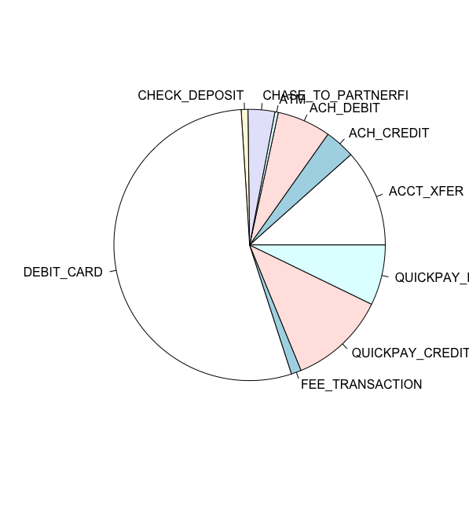
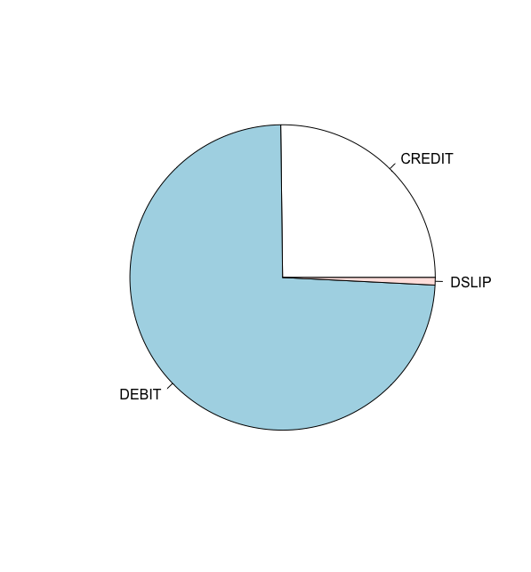

# Data Driven decison making for the self

This project is aimed to be an extention of the ideas presented by the Quantified Self. I chose to answer the question: What kind of data do I generate and what insights can I gain from it?

I'd like to call this idea or process as "Data driven decsion making for the self". We use many products and services on a daily basis that generate a lot of data. Personal analytics is a gaining ground as we no longer just track activity data. I have chosen the following data sources: Whatsapp chat data(soon), Microsoft Outlook data, Fitbit activity and sleep data, Bank transaction data.
So, almost everything we do generates data. Through Personal Analytics we tend to put ourselves in the postion of an experimental subject. I just find it interesting to analyze the data that I create.

Below is an example:
###Expenses analysis:
The data set contains all transactions made from September 2018 - Present. We perform some basic analytics such as and obtain some interesting results related to: what are the different types of transactions involved? How many times have I swiped my card? How many times did I go to a subway? 

Different categories of transactions

Nature of transaction

     ACCT_XFER         ACH_CREDIT          ACH_DEBIT                ATM CHASE_TO_PARTNERFI 
                29                  9                 16                  1                  8 
     CHECK_DEPOSIT         DEBIT_CARD    FEE_TRANSACTION    QUICKPAY_CREDIT     QUICKPAY_DEBIT 
                 2                135                  3                 29                 18 

###Exploring another area: Sleep
